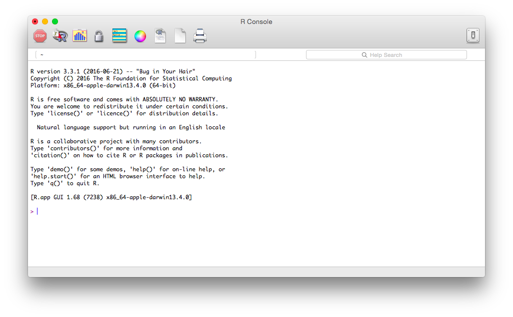
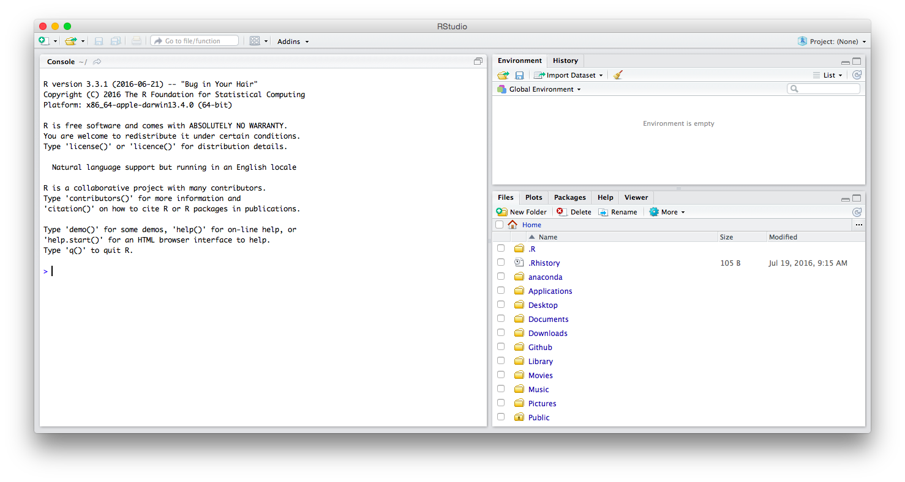
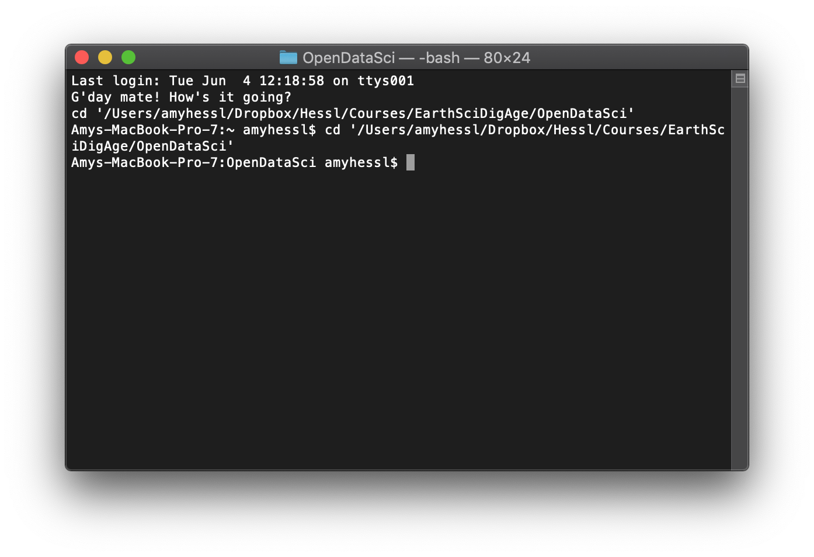

```{r setup, include=FALSE}
knitr::opts_chunk$set(echo = TRUE)
```

### Install R and RStudio
Before we can become open data scientists, sharing our amazing results on the interwebs, we need to install a language (R), an IDE (RStudio), and a version control system (GitHub). I encourage you to install these on your laptop if you have one.  If you do not, you can use the computers in Brooks 418 which already have R and RStudio installed.  If you use these machines, you will still need to set up an account on GitHub (see #3 below).

#### R  
R is an open-source programming language based on  S from the 1970s. It is very popular in the physical and social sciences due to it’s cost (free) and versatility. It's basic functions include computational functions and many statistical functions. Thousands of expansion libraries ('packages') have been published which extend the tasks R can perform, and users can write their own custom functions and/or libraries to perform specific operations or modify existing packages.

__Installing R__
Download the latest binary distribution for your operating system (e.g. Windows, Mac OS X, or Linux) from CRAN, a network of servers around the world which store identical copies of the R binaries, source code, and thousands of additional libraries. The binary version has been pre-compiled and is the easiest to install. Windows users should make sure to select the binary for the base distribution.  

Run the installation from the file you just downloaded (.exe or .pkg).
Open R. You should see a screen similar to this:



This is the R console. You can use this as your development environment where you write and execute code. However the default R console is very minimalistic and does not allow you to integrate with other tools like text editors and GitHub. This is why we will use RStudio for programming in R. However to demonstrate that your R installation works, type 2 + 2 in the console and press enter. You should see the following:

```{r calcs}
2+ 2
```
  
#### Setup RStudio
The base R console is not the best for developing and writing programs. Instead, we want an integrated development environment (IDE) which will allow us to write and execute code, debug programs, and connect with a version control system like GitHub. Enter RStudio - it is open source, easy to use and new tools are constantly being added.

__Installing RStudio__  
Download the [latest version of RStudio](https://www.rstudio.com/products/rstudio/download/) appropriate for your operating system. Be sure to select the “Installer”, not the “Zip” files or source code. For Windows users, the file should have a .exe extension; Mac users should see a .dmg extension.

_Test it!_
To make sure you’ve done everything correctly, open up RStudio on your computer. You should see something that looks like this:


We’ll discuss this in more detail later, but the RStudio IDE is divided into 4 separate panes (one of which is hidden for now) which all serve specific functions. For now, to make sure R and RStudio are setup correctly, type:  
```{r object, eval=FALSE}
x <- 5 + 2  
```
into the console pane (the one on the left side of your screen - this is equivalent to the main window you saw when you opened the base R program, where you can type and run live R code) and execute it by pressing Enter/Return. 

You just created an object in R called x. What does this object contain? Type print(x) into the console and press enter again. Your console should now contain the following output:

```{r results}
x <- 5 + 2
print(x)
```

__Updating R and RStudio__  
If you already installed R or RStudio for a previous course or research, update both to the most current version. When you update R, you don’t actually remove the old version - you simply have both versions on your computer and default to the most recent version. Sometimes this is useful when specific R libraries require an older version of R, however we will generally stick to the most recent versions of R and RStudio.
When you update R, make sure to update your libraries as well. The following command should perform most of this work (note you may have to manually update certain libraries such as those installed directly via Github).

```{r update, eval=FALSE}
update.packages(ask = FALSE, checkBuilt = TRUE)
```

#### GitHub
To use GitHub, you need to do three things:
1) Register for account
2) Install git 
3) Configure Git

__Register for a [free GitHub account](https://www.github.com/join)__  
As a university student, also check to see if you are eligible for GitHub Education offers. Some of these are very useful, such as unlimited private repositories. Remember that once you create a GitHub account, you are stuck with that username. Choose something professional and start building a positive social media presence.

__Git Installation: Windows__
Install [Git for Windows](https://gitforwindows.org/)  
Windows users will need Git for Windows, also known as msysgit or “Git Bash”, to get Git in addition to some other useful tools, such as the Bash shell. The names are maddeningly similar, but their differences are important!

This method of installing Git for Windows leaves the Git executable in a conventional location, which will help you and other programs, e.g. RStudio, find it and use it. This also supports a transition to more expert use, because the “Git Bash” shell will be useful as you venture outside of R/RStudio.

When asked about “Adjusting your PATH environment”, make sure to select _“Git from the command line and also from 3rd-party software”_. Otherwise,accept the defaults.  

If you follow these instructions and install RStudio version 1.1 or higher, you can use the shell (also called the terminal) directly from within RStudio. 

__Git Installation: Mac OS X__  
Mac OS X already includes the shell, so all you need to do is install Git.

_Option 1 (highly recommended)_  
Install the Xcode command line tools (not all of Xcode), which includes Git.

Go to the shell and enter one of these commands to elicit an offer to install developer command line tools:

```{bash git, eval=FALSE}
git --version
git config
```

Accept the offer! Click on “Install”.

Here’s another way to request this installation, more directly:

```{bash xcode, eval=FALSE}
xcode-select --install
```

Note also that, after upgrading macOS, you might need to re-do the above and/or re-agree to the Xcode license agreement. We have seen this cause the RStudio Git pane to disappear on a system where it was previously working. Use commands like those above to tickle Xcode into prompting you for what it needs, then restart RStudio.

_Option 2 (recommended)_  
Install Git from [http://git-scm.com/downloads](http://git-scm.com/downloads)

This arguably sets you up the best for the future. It will certainly get you the latest version of Git of all approaches described here.

The GitHub home for the macOS installer is  [https://github.com/timcharper/git_osx_installer](https://github.com/timcharper/git_osx_installer).
At that link, you can find more info if something goes wrong or you are working on an old version of macOS.

__Configure Git/GitHub__    
Open the shell on your computer. The shell is your direct line of communication with the computer. You should now be able do this from RStudio. Click on the 'Tools' tab and select "Shell". The shell should look something like this:


At the prompt, type the following commands (replace the relevant parts with your own information):

```{bash git user.name, eval=FALSE}
git config --global user.name 'Amy Hessl'
```
This can be your full name, your username on GitHub, whatever you want. Each of your commits will be logged with this name, so make sure it is informative for others.

```{bash git email, eval=FALSE}
git config --global user.email 'amy.hessl@mail.wvu.edu'
```
This must be the email address you used to register on GitHub. You will not see any output from these commands. To ensure the changes were made, run 

```{bash git global, eval=FALSE}
git config --global --list
```

#### Confused Yet?
So many have been confused before you and many will be so after you.  Jenny Bryan (jennybryan.org), Software Engineer at RStudio has authored a great website to help, called:  
[happygitwithr.com](https://happygitwithr.com/).  
__BOOKMARK IT!__


_This page was derived in part from Benjamin Soltoff's MACS 30500 - [Computing for the Social Sciences](https://cfss.uchicago.edu/) at University of Chicago_
