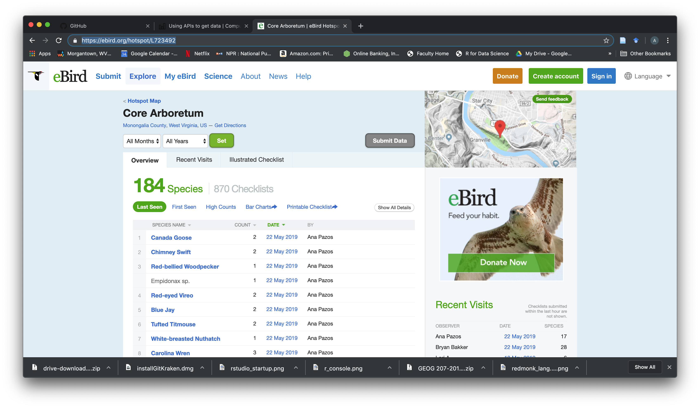

```{r setup, include=FALSE}
knitr::opts_chunk$set(echo = TRUE)
```

```{r, include=FALSE}
#source("../.Rprofile")
```

You will need to install these libraries for this unit:
```{r libraries, message=FALSE}
library(rebird)
library(tidyverse)
library(geonames)
library(manifestoR)
library(tidycensus)
library(forcats)
library(broom)
library(wordcloud)
library(tidytext)
library(viridis)

set.seed(1234)
theme_set(theme_minimal())
```

There are many ways to obtain data from the internet. Four major categories are:

* click-and-download on the internet as a “flat” file, such as .csv, .xls  
* use wget through the shell to download lots of files (scraping)  
* install-and-play an API for which someone has written a handy R package  
* API-query published with an unwrapped API  

#### Click-and-Download
In the simplest case, the data you need is already on the internet in a tabular format. There are a couple of strategies here:

Use read.csv('url/to/filename',...) to read the data straight into R. (Similar options include: download.file, downloader package). From the shell, one could use wget or curl to download the file and store a local copy, then use read_csv or something similar to read the data into R. Even if the file disappears from the internet, you have a local copy cached. Regardless, files may need cleaning and transformation when you bring them into R.

#### Getting Data Through an API
Application Programming Interface (API)
Many times, the data that you want is not already organized into one or a few tables that you can read directly into R. More frequently, you find access to the data allowed through an API. Application Programming Interfaces (APIs) are descriptions of the kind of requests that can be made of a certain piece of software, and descriptions of the kind of answers that are returned. Many sources of data - databases, websites, services - have made all (or part) of their data available via APIs over the internet. Computer programs (“clients”) can make requests of the server, and the server will respond by sending data (or an error message). This client can be many kinds of other programs or websites, including R running from your laptop.

#### Install and play packages
Many common web services and APIs have been “wrapped”, i.e. R functions have been written around them which send your query to the server and format the response.

_Why do we want this?_

* provenance of data is recorded in script  
* reproducible  
* data can be easily updated  
* ease of use  
* scaling to lots of files  

#### Something Fun: Dr. Hessl's Coauthor Network from Google Scholar
```{r, include=FALSE}
# install.packages("devtools")
devtools::install_github("cimentadaj/coauthornetwork")
library('coauthornetwork')
```
Might need to enter a blank line here...
```{r}
hessl_network <- grab_network('citations?hl=en&user=7_BWrfIAAAAJ',n_coauthors = 10, n_deep=1)
plot_coauthors(hessl_network, size_labels = 3)
```

#### Sightings of birds: `rebird`
rebird is an R interface for the [e-Bird database](https://ebird.org). e-Bird lets birders upload sightings of birds, and allows everyone access to those data.

##### Search birds by geography
The ebird website categorizes some popular locations as “Hotspots”. These are areas where there are both lots of birds and lots of birders. Once such location is at [Core Arboretum](https://ebird.org/hotspot/L723492)

At that link, you can see a page like this:



The data already look to be organized in a data frame! rebird allows us to read these data directly into R.

The ID code for Core Arboretum is L723492.  We will also need a 'key'.  This is required by eBird and many other APIs to ensure that we are a registered user and not a bot.  You can get an [account](https://secure.birds.cornell.edu/cassso/login) and a [key](https://ebird.org/data/request) for eBird.  If you plant to use it again, you can save it in your .Renviron file that is read on startup of R.  You can locate this in your user directory and everytime you start that project, R will read those variables upon startup.

`atom ~/.Renviron`

All you need to put in that hidden text file is:

`EBIRD_KEY = 'yourcode'`
And a blank line.

OR you can use Sys.setenv:
```{r, eval=FALSE}
Sys.setenv(EBIRD_KEY = "yourcode")
```

Now you must restart RStudio for R to read .Renviron file on startup.  It's a useful place to store any variable you wish to use often.  If you are having trouble getting R to read it at startup, you can always source it:

```{r, eval=FALSE}
readRenviron("~/.Renviron")
```

To check that you can retrieve that key from the system environment, use:
```{r, eval=F}
Sys.getenv("EBIRD_KEY")
```
We can use the function ebirdgeo() to get a list for an area and then use dplyr to use pipes to make a tibble and take glimpse of the data:

```{r ebrirdgeo}
arbobirds <- ebirdgeo(lat = 39.645810, lng = -79.978924, key = Sys.getenv("EBIRD_KEY"))
arbobirds %>%
  as_tibble() %>%
  glimpse()
```


Note: Check the defaults on this function. e.g. radius of circle, time of year.

We can also search by “region”, which refers to short codes which serve as common shorthands for different political units. For example, Washington DC is represented by the letters US-DC:

```{r ebirdregion}
DCbirds <- ebirdregion("US-DC", key = Sys.getenv("EBIRD_KEY"))

head(DCbirds)
```

### API authentication
Many APIs require you to register for access. This allows them to track which users are submitting queries and manage demand - if you submit too many queries too quickly, you might be rate-limited and your requests de-prioritized or blocked. Always check the API access policy of the web site to determine what these limits are.

#### Searching geographic info: `geonames`
There are a few things we need to do to be able to use this package to access the geonames API:

* Go to the geonames site and register an account.  
* Add your geonames username to your R your geonames username to your .Renviron in your .Rproj directory. 

```options(geonamesUsername="myusernamehere")```

Since I placed my username in my .Renviron file, I do the following:
```{r}
options(geonamesUsername = Sys.getenv("geonamesUsername"))
```

_Important_  
* Make sure your .Renviron ends with a blank line.  
* Make sure .Renviron is included in your .gitignore file, otherwise it will be synced with Github.  
* Restart RStudio after modifying .Renviron in order to load any new keys into memory.  
* Spelling is important when you set the option in your .Renviron.  

This is a simple means to keep your keys and usernames private, especially if you are sharing the same authentication across several projects. Remember that using .Renviron makes your code un-reproducible. In this case, that is exactly what we want!

#### Using `geonames`
Get access to lots of geographical information via the various “web services”
```{r, eval=TRUE}
countryInfo <- GNcountryInfo()
head(countryInfo)
```

This country info dataset is very helpful for accessing the rest of the data, because it gives us the standardized codes for country and language.

#### The Manifesto Project: `manifestoR`
The Manifesto Project collects and organizes political party manifestos from around the world. It currently covers over 1000 parties from 1945 until today in over 50 countries on five continents. We can use the manifestoR package to access the API and download those manifestos for analysis in R.

##### Load library and set API key
Accessing data from the Manifesto Project API requires an authentication key. You can create an account and key [here.](https://manifesto-project.wzb.eu/signup) Here I store my key in .Rprofile and retrieve it using mp_setapikey().

##### retrieve API key stored in .Rprofile
```{r, eval=TRUE}
mp_setapikey(key=Sys.getenv("manifesto_key"))
#Retrieve the database
(mpds <- mp_maindataset())
```

mp_maindataset() includes a data frame describing each manifesto included in the database. You can use this database for some exploratory data analysis. For instance, how many manifestos have been published by each political party in Sweden?

Using piping in dplyr and ggplot2, we can do this pretty quickly.

```{r, eval=TRUE}
mpds %>%
  filter(countryname == "Sweden") %>%
  count(partyname) %>%
  ggplot(aes(fct_reorder(partyname, n), n)) +
  geom_col() +
  labs(title = "Political manifestos published in Sweden",
       x = NULL,
       y = "Total (1948-present)") +
  coord_flip()
```

Or we can use scaling functions to identify each party manifesto on an ideological dimension. For example, how have the Democratic and Republican Party manifestos in the United States changed over time?

```{r, eval=T}
mpds %>%
  filter(party == 61320 | party == 61620) %>%
  mutate(ideo = mp_scale(.)) %>%
  select(partyname, edate, ideo) %>%
  ggplot(aes(edate, ideo, color = partyname)) +
  geom_line() +
  scale_color_manual(values = c("blue", "red")) +
  labs(title = "Ideological scaling of major US political parties",
       x = "Year",
       y = "Ideological position",
       color = NULL) +
  theme(legend.position = "bottom")
```
mp_scale is a scaling function built in to manifestoR...

#### Download manifestos
mp_corpus() can be used to download the original manifestos as full text documents stored as a corpus. Once you obtain the corpus, you can perform text analysis. As an example, let’s compare the most common words in the Democratic and Republican Party manifestos from the 2016 U.S. presidential election:

```{r, eval=T, warning=FALSE}
(docs <- mp_corpus(countryname == "United States" & edate > as.Date("2015-01-01")))

# generate wordcloud of most common terms
docs %>%
  tidy() %>%
  mutate(party = factor(party, levels = c(61320, 61620),
                        labels = c("Democratic Party", "Republican Party"))) %>%
  unnest_tokens(word, text) %>%
  anti_join(stop_words) %>%
  count(party, word, sort = TRUE) %>%
  na.omit() %>%
  reshape2::acast(word ~ party, value.var = "n", fill = 0) %>%
  comparison.cloud(max.words = 200)
```
Try comparing to the 2012 election!

#### Census data with `tidycensus`
tidycensus provides an interface with the US Census Bureau’s decennial census and American Community APIs and returns tidy data frames with optional simple feature geometry. These APIs require a free key you can obtain [here.](https://api.census.gov/data/key_signup.html) Rather than storing your key in .Rprofile, tidycensus includes census_api_key() which automatically stores your key in .Renviron, which is basically a global version of .Rprofile. Anything stored in .Renviron is automatically loaded anytime you initiate R on your computer, regardless of the project or file location. Once you get your key, load it to your .Renviron file:

```census_api_key("census_key", install = TRUE)```
Or since I have my census_api_key stored in .Renviron

If you don't want to restart R, you can use readRenviron() to read the installed key.

#### Obtaining data
get_decennial() allows you to obtain data from the 1990, 2000, and 2010 decennial US censuses. Let’s look at the number of individuals of Asian ethnicity by state in 2010:

```{r}
asia10 <- get_decennial(geography = "state", variables = "P008006", year = 2010)

asia10 
```
The result of get_decennial() is a tidy data frame with one row per geographic unit-variable.

GEOID - identifier for the geographical unit associated with the row  
NAME - descriptive name of the geographical unit  
variable - the Census variable encoded in the row  
value - the value of the variable for that geographic unit  
We can quickly visualize this data frame using ggplot2:

```{r}
ggplot(asia10, aes(x = reorder(NAME, value), y = value)) +
  geom_point() +
  coord_flip()
```

Of course this graph is not entirely useful since it is based on the raw frequency of Asian individuals. California is at the top of the list, but it is also the most populous city. Instead, we could normalize this value as a percentage of the entire state population. To do that, we need to retrieve another variable:

```{r}
asia_pop <- get_decennial(geography = "state",
                          variables = c("P008006", "P008001"),
                          year = 2010) %>%
  spread(variable, value) %>%
  mutate(pct_asia = P008006 / P008001)

asia_pop
```

```{r}
ggplot(asia_pop, aes(x = reorder(NAME, pct_asia), y = pct_asia)) +
  geom_point() +
  scale_y_continuous(labels = scales::percent) +
  coord_flip()
```

get_acs() retrieves data from the American Community Survey. This survey is administered to a sample of 3 million households on an annual basis, so the data points are estimates characterized by a margin of error. tidycensus returns both the original estimate and margin of error. Let’s get median household income data from the 2012-2016 ACS for counties in Illinois.

```{r}
usa_inc <- get_acs(geography = "state", 
                   variables = c(medincome = "B19013_001"), 
                   year = 2016)
usa_inc
```

Now we return both an estimate column for the ACS estimate and moe for the margin of error (defaults to 90% confidence interval).

```{r}
usa_inc %>%
  ggplot(aes(x = reorder(NAME, estimate), y = estimate)) +
  geom_pointrange(aes(ymin = estimate - moe,
                     ymax = estimate + moe),
                  size = .25) +
  coord_flip() +
  labs(title = "Household income by state",
       subtitle = "2012-2016 American Community Survey",
       x = "",
       y = "ACS estimate (bars represent margin of error)")
```

#### Search for variables
get_acs() or get_decennial() requires knowing the variable ID, of which there are thousands. load_variables() downloads a list of variable IDs and labels for a given Census or ACS and dataset. You can then use View() to interactively browse through and filter for variables in RStudio.
```{r}
v15 <- load_variables(2015, "acs5", cache = TRUE)
```

#### Drawing maps
tidycensus also can return simple feature geometry for geographic units along with variables from the decennial Census or ACS, which can then be visualized using geom_sf(). Let’s look at median household income by Census tracts from the 2012-2016 ACS in Preston County, West Virginia:

```{r, warning=FALSE, message=FALSE}
monongalia <- get_acs(state = "WV",
                   county = "Monongalia",
                   geography = "tract", 
                   variables = c(medincome = "B19013_001"), 
                   year = 2016,
                   geometry = TRUE)
monongalia
```

This looks similar to the previous output but because we set geometry = TRUE it is now a simple features data frame with a geometry column defining the geographic feature. We can visualize it using geom_sf() and viridis::scale_*_viridis() to adjust the color palette.

```{r}
ggplot(data = monongalia) +
  geom_sf(aes(fill = estimate, color = estimate)) + 
  #coord_sf(crs = 26911) +  #coord ref system
  scale_fill_viridis(option = "magma") + 
  scale_color_viridis(option = "magma") 
  
```

#### Key Points 
* APIs and wrappers in R packages allow for easy download and querying of data.  
* API keys and storage in .Rprofile or .Renviron are finicky.  
* dplyr is an easy way to pipe commands in R for efficient scripts.  

#### __Acknowledgments__
_These pages were derived in part from:Benjamin Soltoff's MACS 30500 - [Computing for the Social Sciences](https://cfss.uchicago.edu/) at University, and from [Software Carpentry](software-carpentry.org), licensed under the CC BY-NC 3.0 Creative Commons_