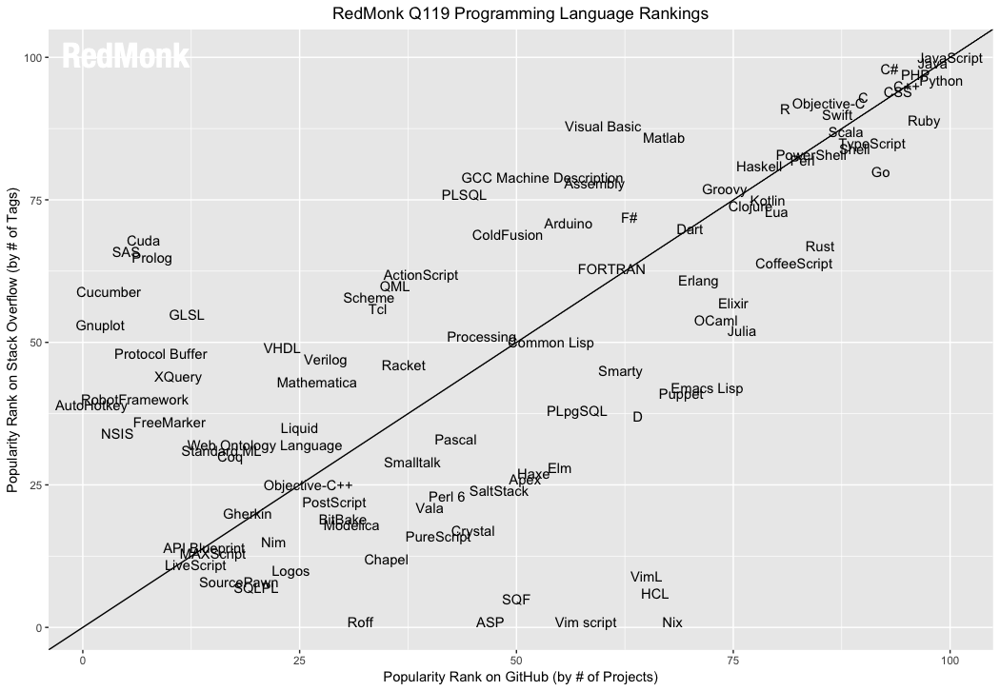

```{r setup, include=FALSE}
knitr::opts_chunk$set(echo = TRUE)
```

### Open Data Science
_"Stand on the Shoulders of Giants"_  
Dwarfs standing on the shoulders of giants is a famous metaphor explaining how we make progress in science.  We build on the discoveries and techniques already developed.  

But this progress is only possible if we can reproduce what the giants have achieved. In the past, this meant carefully reading the methods section of a paper. But have you ever read the methods and thought: __"I'm not sure exactly what they did here"__?  

In the digital age, we have the capacity to make the exact computational methods and data open to everyone so that we may truly stand on the shoulders of giants, even though we may be dwarfs.

This course teaches students how to think and work programatically so that we dwarfs can borrow from today's giants and in future, share our data and methods with the next generation of dwarfs. In this course, we will learn computational approaches to address scientific questions.  And, we will learn how to share not only our results, but our exact methods with others.  

__Good News:__ Writing code, debugging, getting help online, and collaborating with others has gotten a lot easier!  IDE's (Integrated Development Environments) like RStudio allow us to use multipe programming tools in a single environment, online communities like Stack Overflow can help you solve problems, and version control systems like GitHub allow us to keep track of our code and collaborate with other programmers.

Much of computer programming involves translating what you wish to do into a set of computational instructions. This requires a language.  There are many languages available to us (Python, Java, Matlab, etc.), and they all have their sweet spot. R is the language of choice for statistical analysis and has a massive community of users in academics.

In this course, we will learn how to use [R](https://www.r-project.org/) for computational analysis, [RStudio](https://www.rstudio.com/) for writing, editing, running code, and [GitHub](https://github.com/) for tracking changes in your code and collaborating with other dwarves.

### Why R?
__Open-source__
R is open-source software, which means using it is completely free. Open-source software is developed collaboratively, meaning the source code is open to public inspection, modification, and improvement. 

__Popular__  
R is widely used in the physical and social sciences, as well as in government, non-profits, and the private sector.

Many developers and social scientists write programs in R. As a result, there is also a large support community available to help troubleshoot problematic code. As seen in the Redmonk programming language rankings (which compare languages’ appearances on Github [usage] and StackOverflow [support]), R appears near the top of both rankings.



__R is a computing language__  
As a computing language, R does not have a point-and-click interface, instead it relies on  execution of __functions__. For us, this means that to do anything, you must write code. This differs from popular statistical software such as Stata or SPSS which at their core utilize a command language but overlay them with drop-down menus that enable a point-and-click interface. While much easier to operate, there are several downsides to this approach - mainly that it makes it _impossible to reproduce one’s analysis_.

__Things R does well__  
Data analysis - R was written by statisticians for statisticians, so it is designed first and foremost as a language for statistical and data analysis. Much of the cutting-edge research in machine learning occurs in R, and every week there are packages added to CRAN implementing these new methods. Furthermore, many models in R can be exported to other programming languages such as C, C++, Python, tensorflow, stan, etc.

Data visualization - while the base R graphics package is comprehensive and powerful, additional libraries such as ggplot2 and lattice make R the go-to language for power data visualization approaches.

__Things R does not do as well__  
Speed - while by no means a slug, R is not written to be a fast, speedy language. Depending on the complexity of the task and the size of your data, you may find R taking a long time to execute your program.


### Install R and RStudio
Before we can become open data scientists, sharing our amazing results on the interwebs, we need to install a language (R), and IDE (RStudio) and a version control system (GitHub). I encourage you to install these on your laptop if you have one.  If you do not, you can use the computers in Brooks 418.  Regardless, you will need to set up an account on GitHub (see #3 below).

### Git
_What is Git?_ Git is a version control system that allows you to track all changes in a project (called a _repository_ or _repo_) stored both on your local computer and in the cloud.  It also allows you to collaborate with others on coding and analysis projects and keep track of their changes too. 

If you completed [Installing Software]() before the first class, you would have already registered for a free [GitHub account](https://github.com/). As a university student, also check to see if you are eligible for GitHub Education offers. Some of these are very useful, such as unlimited private repositories. Remember that once you create a GitHub account, you are stuck with that username. Choose something professional and start building a positive social media presence.

### Markdown and R Markdown 
We will be submitting written assignments using [Markdown.](https://www.markdownguide.org) Markdown (`.md`) is a lightweight markup language that will convert plain text into formatted text.  In other words, it can take plain text and convert to html tool. Because it is lightweight and easy to use. It is integrated directly into [R Markdown](https://rmarkdown.rstudio.com/), which combines R code, output, and written text into a single document (`.Rmd`). Regular Markdown files (`.md`) are rendered on the GitHub website and can be directly read on the website. GitHub includes a [guide](https://guides.github.com/features/mastering-markdown/) for writing Markdown documents that will be handy for you as you complete your first assignment.

### HW_0 Let's Fork Our First Repo!
Forking in GitHub means that you are downloading a copy ('clone') of an existing repository. Homework in this class will all be completed using GitHub.  Each homework is in it's own repo.  To complete the homework you will need to:

* Fork the repository to your GitHub account
* Modify and add files  
* Commit changes  
* Push the changes up to GitHub (not necessary if working from website)  
* Create a pull request on the original repository to turn in the assignment. Make sure to include __your name in the pull request__.  

#### Fork and Clone HW_0
1) Log in to your GitHub account.  
2) Follow the link to [hessllab](https://github.com/hessllab) where you can find HW_0.  Click on that repo and open it. You should see previous commits listed as well as directory for _/images_ and files including my _README.md_.  
3) Click on the button to `fork` the repo.  GitHub will copy the whole repo to your account. You can edit away and make whatever changes you like including adding new files - all directly in GitHub.  We will learn more sophisticated and flexible ways of working in Git soon.

#### Make a new branch using your name
1) Go to your new repository __HW_0__.  
2) Click the drop down at the top of the file list that says branch: master.  
3) Type a branch name, ex: _student-name_, into the new branch text box.  
4) Select the blue Create branch box or hit “Enter” on your keyboard.  

#### Make, Add, and Commit Changes
1) Click on the _README.md_ file. GitHub will render that file as you would see it on the web.  It will also keep track of changes.
2) Click on the pencil (far right) to view the _.md_ file. Make some edits - any edits - no need to save. You will make a commit instead.
3) Type a commit message describing the change(s).

##### What is a commit message?
A commit message is a note to yourself and your collaborators describing the changes that you made to the file. That message can be critical when you want to return to an earlier version of your repo.  Write something that tells the reader what you just did.

#### Make a Pull Request on hessllab/HW_0
Pull requests are the heart of collaboration on GitHub. When you open a pull request, you’re proposing your changes and requesting that someone review and pull in your contribution and merge them into their branch. Pull requests show diffs, or differences, of the content from both branches. The changes, additions, and subtractions are shown in green and red.

As soon as you make a commit, you can open a pull request and start a discussion, even before the code is finished.

1) Click the  Pull Request tab, then from the Pull Request page, click the green `New pull request` button.
2) In the `Example Comparisons` box, select the branch you made, _student-name_, to compare with master (the original). Here, the branch I made is called _readme-edits_.


You should be able to see that GitHub has identified the deletions you made in red and additions in green. Lots of other symbols there too, we can get to those later.
3) Click on the green pull request button and leave me a message __WITH YOUR NAME AT THE BEGINNING__. This is how I will know it's you, especially if your GitHub handle is not your name.
4) Click the green pull request button again to finish.

__You can continue to make edits, repeat the pull request until the submission deadline.__

Go back to `code` and start again from "Make, Add, and Commit Changes" above.

#### Feedback on your homework submissions
I will provide feedback on your homework through both messages on your pull requests and suggested changes or comments in the scripts themselves.  Be sure to check both on GitHub so that you can continue to improve!

#### __Acknowledgments__
_This page was derived in part from Benjamin Soltoff's MACS 30500 - [Computing for the Social Sciences](https://cfss.uchicago.edu/) at University of Chicago and from [UBC STAT 545A and 547M](http://stat545.com/Classroom/), licensed under the CC BY-NC 3.0 Creative Commons License._

