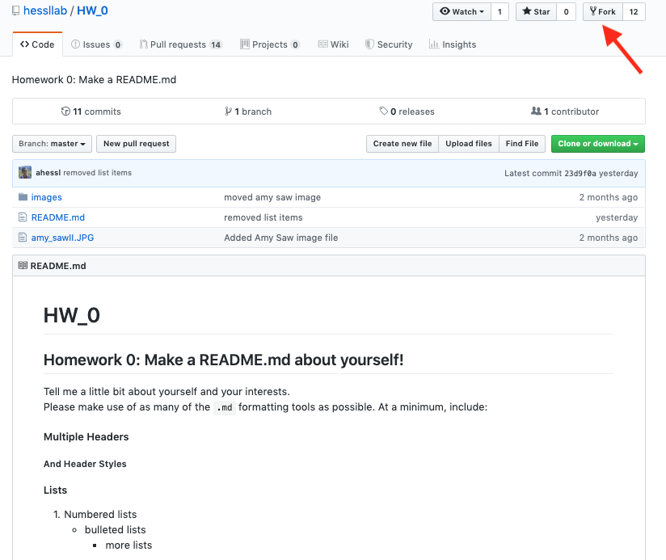
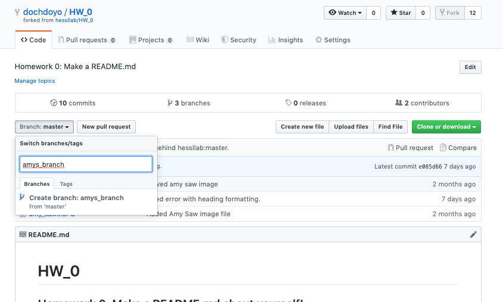

```{r setup, include=FALSE}
knitr::opts_chunk$set(echo = TRUE)
```

### Let's Fork Our First Repo!
Forking in GitHub means that you are downloading a copy ('clone') of an existing repository. Homework in this class will all be completed using GitHub.  Each homework is in it's own repo.  To complete the homework you will need to:

* Fork the repository to your GitHub account
* Modify and add files  
* Commit changes  
* Push the changes up to GitHub (not necessary if working from website)  
* Create a pull request on the original repository to turn in the assignment. Make sure to include __your name in the pull request__.  

#### Fork and Clone HW_0
1) Log in to your GitHub account.  
2) Follow the link to [hessllab](https://github.com/hessllab) where you can find HW_0.  All of our homework assignments will be posted here.  Click on the `HW_0` repo and open it. You should see previous commits listed as well as directory for _/images_ and files including my _README.md_.  
3) Click on the button to `fork` the repo.  GitHub will copy the whole repo to your account. You can edit away and make whatever changes you like including adding new files - all directly in GitHub.  We will learn more sophisticated and flexible ways of working in Git soon.



#### Make a new branch using your name
1) Go to your new repository __StudentName/HW_0__.  
2) Click the drop down at the top of the file list that says branch: master.  
3) Type a branch name, ex: _student-name_, into the new branch text box.  
4) Select the blue Create branch box or hit “Enter” on your keyboard.  

  

#### Make, Add, and Commit Changes
1) Click on the _README.md_ file. GitHub will render that file as you would see it on the web.  It will also keep track of changes.  
2) Click on the pencil (far right) to view the _.md_ file. Make some edits - any edits - no need to save. You will make a commit instead.  Try making a `new file`!  
3) Type a commit message describing the change(s).  

##### What is a commit message?
A commit message is a note to yourself and your collaborators describing the changes that you made to the file. That message can be critical when you want to return to an earlier version of your repo.  Write something that tells the reader what you just did.

#### Make a Pull Request on hessllab/HW_0
Pull requests are the heart of collaboration on GitHub. When you open a pull request, you’re proposing your changes and requesting that someone review and pull in your contribution and merge them into their branch. Pull requests show diffs, or differences, of the content from both branches. The additions, and subtractions are shown in green and red.

As soon as you make a commit, you can open a pull request and start a discussion, even before the code is finished.

1) Click the  Pull Request tab at the top of the screen, then from the Pull Request page, click the green `New pull request` button.
2) In the `Example Comparisons` box, select the branch you made, _student-name_, to compare with master (the original). Here, the branch I made is called _readme-edits_.  
3) Click on the green pull request button and leave me a message __WITH YOUR NAME AT THE BEGINNING__. This is how I will know it's you, especially if your GitHub handle is not your name.   
4) Click the green pull request button again to finish. 
  


> Note: You will get a warning message _'Cannot automatically merge'_ but don't worry!  You can ignore and still make the pull request.  

You should be able to see that GitHub has identified the deletions you made in red and additions in green. Lots of other symbols there too, we can get to those later.  

__You can continue to make edits, and make commits until the submission deadline.__
I will see all of your subsequent commits and I will grade the last one you commit before the assignment deadline.

> Also Note: Once you make a lot of changes, your version will conflict with my old template.  Ignore the warning 'this branch has conflicts that must be resolved'.  We will get to resolving conflicts in subsequent lessons.

#### Feedback on your homework submissions
Your instructor will provide feedback on your homework through both messages on your pull requests and suggested changes or comments in the scripts themselves.  Be sure to check both on GitHub so that you can continue to improve!
