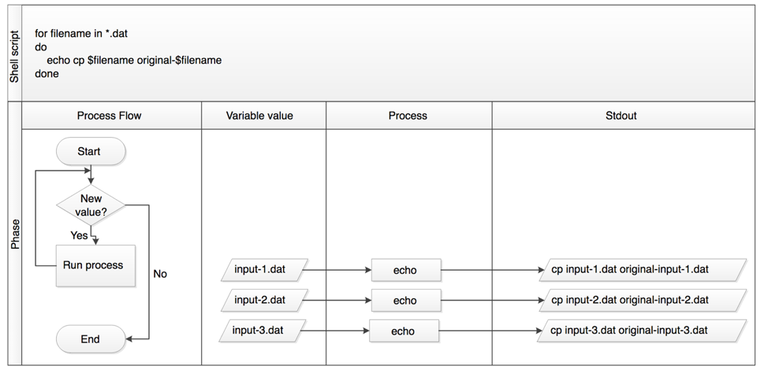

```{r setup, include=FALSE}
knitr::opts_chunk$set(echo = TRUE)
```


_I don't have any particular recipe [for developing new proofs] ... It is like being lost in a jungle and trying to use all the knowledge that you can gather to come up with some new tricks, and with some luck, you might find a way out._  
						--Maryam Mirzakhani, 2014 Fields Medal Winner
						
#### Questions
*	How can I perform the same actions on many different files?     
* How can I execute the same command over and over for different cases?  

#### Objectives
*	Write a loop that applies one or more commands separately to each file in a set of files.  
*	Trace the values taken on by a loop variable during execution of the loop.  
*	Explain the difference between a variable’s name and its value.  
*	Explain why spaces and some punctuation characters shouldn’t be used in file names.  
*	Demonstrate how to see what commands have recently been executed.    
*	Re-run recently executed commands without retyping them.  

#### Key Tools
* `$` and `${}` - define a variable, clearly define variable name  
* `>` - either redirects to file or denotes a loop  
* `for` - to start a for loop  
* `done` - end a for loop  
* `;` - separate multiple commands on same line, run sequentially  
* `&&` - multiple commands are run but only if first is successful  
* `echo` - prints something to screen  
* `Control-c` - escapes out of a (hung) process  
* `Up arrow` - returns previous command lines from prompt  
* `Control-a` - moves cursor to beginning of line  
* `Control-e` - moves cursor end beginning of line  
* `history` - provides last 100 commands by line number  
* `!123` - runs command number 123 from history  

__Loops__ are key to productivity improvements through automation as they allow us to execute commands repetitively. Similar to wildcards and tab completion, using loops also reduces the amount of typing (and typing mistakes). Suppose we have several hundred genome data files named _basilisk.dat_, _unicorn.dat_, and so on. In this example, we’ll use the _creatures_ directory which only has two example files, but the principles can be applied to many many more files at once. We would like to modify these files, but also save a version of the original files, naming the copies _original-basilisk.dat_ and _original-unicorn.dat_. We can’t use:  
`cp *.dat original-*.dat`  

because that would expand to:  
`cp basilisk.dat unicorn.dat original-*.dat`  

This wouldn’t back up our files, instead we get an error:  
`target original-*.dat is not a directory`  

This problem arises when `cp` receives more than two inputs. When this happens, it expects the last input to be a directory where it can copy all the files it was passed. Since there is no directory named _original-*.dat_ in the creatures directory we get an error.

Instead, we can use a __for loop__ to do some operation once for each thing in a list. Here’s a simple example that displays the first three lines of each file in turn:

```{bash}
cd ../data/data-shell/creatures
for filename in basilisk.dat unicorn.dat
  do
      head -n 3 $filename	
done
```
COMMON NAME: basilisk
CLASSIFICATION: basiliscus vulgaris
UPDATED: 1745-05-02
COMMON NAME: unicorn
CLASSIFICATION: equus monoceros
UPDATED: 1738-11-24

#### __For__ loop anatomy:
When the shell sees the keyword `for`, it knows to repeat a command (or group of commands) once for each item in a list. Each time the loop runs (called an __iteration__), an item in the list is assigned in sequence to the variable (`$filename`), and the commands inside the loop are executed, before moving on to the next item in the list. 

Inside the loop, we call for the variable’s value by putting `$` in front of it. The `$` tells the shell interpreter to treat the variable as a variable name and substitute its value in its place, rather than treat it as text or an external command.
In this example, the list is two filenames: _basilisk.dat_ and _unicorn.dat_. Each time the loop iterates, it will assign a file name to the variable filename and run the `head` command. The first time through the loop, `$filename` is _basilisk.dat_. The interpreter runs the command head on _basilisk.dat_, and the prints the first three lines of _basilisk.dat_. For the second iteration, `$filename` becomes `unicorn.dat`. This time, the shell runs head on _unicorn.dat_ and prints the first three lines of _unicorn.dat_. Since the list was only two items, the shell exits the for loop.

`${ }` When using variables it is also possible to put the names into curly braces to clearly delimit the variable name: `$filename` is equivalent to `${filename}`, but is different from `${file}name`. You may find this notation in other people’s programs.

#### Variables in Loops
This exercise refers to the _data-shell/molecules_ directory. `ls` gives the following output:
```{bash, echo = -1}
cd ../data/data-shell/molecules
ls
```

> __Challenge: What is the output of the following code?__  

```{bash, eval=FALSE, echo=-1, engine="sh"}
cd ../data/data-shell/molecules
for datafile in *.pdb  
do  
    ls *.pdb  
done  
```
Now, what is the output of the following code?

```{bash, eval=T, echo=-1, engine="sh"}
cd ../data/data-shell/molecules
for datafile in *.pdb
do
	ls $datafile
done
```

Why do these two loops give different outputs?

#### Follow the Prompt `$` or `>`
The shell prompt changes from `$` to `>` and back again as we were typing in our loop. The second prompt, `>`, is different to remind us that we haven’t finished typing a complete command yet. A semicolon, `;`, can be used to separate two commands written on a single line.
Try using the `up-arrow` to see your last command. What happened?

#### Same Symbols, Different Meanings
Here we see `>` being used a shell prompt, whereas `>` is also used to redirect output. Similarly,`$` is used as a shell prompt, but, as we saw earlier, it is also used to ask the shell to get the value of a variable.
If the shell prints `>` or `$` then it expects you to type something, and the symbol is a prompt.
If you type `>` or `$` yourself, it is an instruction from you that the shell to redirect output or get the value of a variable.

Returning to our example in the _data-shell/creatures_ directory, we have called the variable in this loop filename in order to make its purpose clearer to human readers. The shell itself doesn’t care what the variable is called; if we wrote this loop as:

```{bash, eval=TRUE, echo=TRUE, engine="sh"}
cd ../data/data-shell/creatures
for x in basilisk.dat unicorn.dat
do
    head -n 3 $x
done
```
or:
```{bash, eval=T, echo=TRUE, engine="sh"}
cd ../data/data-shell/creatures
for temperature in basilisk.dat unicorn.dat
do
    head -n 3 $temperature
done
```

It should work exactly the same way. Which is better? Why?

Programs are only useful if people can understand them, so meaningless names (like x) or misleading names (like temperature) increase the odds that the program won’t do what its readers think it does.

> __Challenge: What would be the output of running the following loop in the data-shell/molecules directory?__

```{bash, eval=FALSE, echo=TRUE, engine="sh"}
cd ../data/data-shell/molecules
for filename in c*
do
    ls $filename 
done
```
1.	No files are listed.  
2.	All files are listed.  
3.	Only cubane.pdb, octane.pdb and pentane.pdb are listed.  
4.	Only cubane.pdb is listed.  

It's pretty sweet that the Shell automatically recognizes that `c*` refers to `ls c*`


#### Limiting Sets of Files
How would the output differ from using this command instead?
```{bash, eval=FALSE, echo=-1, engine="sh"}
cd ../data/data-shell/molecules
for filename in *c*
do
    ls $filename 
done
```
1.	The same files would be listed.  
2.	All the files are listed this time.  
3.	No files are listed this time.  
4.	The files cubane.pdb and octane.pdb will be listed.  
5.	Only the file octane.pdb will be listed.  
Let’s continue with our example in the _data-shell/creatures_ directory. Here’s a slightly more complicated loop:  
```{bash, eval=TRUE, echo=-1, engine="sh"}
cd ../data/data-shell/creatures
for filename in *.dat
do
    echo $filename
    head -n 100 $filename | tail -n 20
done
```
The shell starts by expanding _*.dat_ to create the list of files it will process. The loop body then executes two commands for each of those files. The first, `echo`, just prints its command-line arguments to standard output. For example:
```{bash}
echo hello world
```

In this case, since the shell expands `$filename` to be the name of a file, `echo $filename` just prints the name of the file. 

Finally, the head and tail combination selects lines 81-100 from whatever file is being processed (assuming the file has at least 100 lines).

#### Spaces in Names
Whitespace is used to separate the elements on the list that we are going to loop over. If on the list we have elements with whitespace we need to quote those elements and our variable when using it. Suppose our data files are named:
_red dragon.dat_  
_purple unicorn.dat_  

We would need to use:  
```{bash, eval=F, echo=-1, engine="sh"}
cd ../data/data-shell/molecules
for filename in "red dragon.dat" "purple unicorn.dat"
do
    head -n 100 "$filename" | tail -n 3
done
```
It is simpler just to avoid using whitespaces (or other special characters) in filenames.
The files above don’t exist, so if we run the above code, the `head` command will be unable to find them, however the error message returned will show the name of the files it is expecting.

Try removing the quotes around `$filename` in the loop above to see the effect of the quote marks on whitespace. Note that we get a result from the loop command for _unicorn.dat_ when we run this code in the creatures directory:

```{bash, eval=F, echo=-1, engine="sh"}
cd ../data/data-shell/creatures
for filename in red dragon.dat purple unicorn.dat
do
    head -n 100 $filename | tail -n 3
done
```

Going back to our original file copying problem, we can solve it using this loop:
```{bash, eval=F, echo=-1, engine="sh"}
cd ../data/data-shell/creatures
for filename in *.dat
do
    cp $filename original-$filename
done
```
This loop runs the `cp` command once for each filename. The first time, when `$filename` expands to basilisk.dat, the shell executes:
cp basilisk.dat original-basilisk.dat

The second time, the command is:
`cp unicorn.dat original-unicorn.dat`  

Since the `cp` command does not normally produce any output, it’s hard to check that the loop is doing the correct thing. By prefixing the command with `echo` it is possible to see each command as it would be executed. The following diagram shows what happens when the modified script is executed, and demonstrates how the judicious use of echo is a good debugging technique.

```{bash, eval=T, echo=F, engine="sh"}
rm ../data/data-shell/creatures/original*.dat
```
 

#### Nelle’s Pipeline: Processing Files
Nelle is now ready to process her data files using goostats — a shell script written by her supervisor. This calculates some statistics from a protein sample file, and takes two arguments:
1.	an input file (containing the raw data)  
2.	an output file (to store the calculated statistics)  
Since she’s still learning how to use the shell, she decides to build up the required commands in stages. Her first step is to make sure that she can select the right input files — remember, these are ones whose names end in ‘A’ or ‘B’, rather than ‘Z’. Starting from the _north-pacific-gyre/2012-07-03_ folder, Nelle types:

```{bash gooloop, echo=-1}
cd ../data/data-shell/north-pacific-gyre/2012-07-03
for datafile in NENE*[AB].txt
 do
     echo $datafile
 done
```

Her next step is to decide what to call the files that the goostats analysis program will create. Prefixing each input file’s name with “stats” seems simple, so she modifies her loop to do that:

```{bash gooloop, echo=-1}
cd ../data/data-shell/north-pacific-gyre/2012-07-03
for datafile in NENE*[AB].txt
 do
     echo $datafile stats-$datafile
 done
``` 

She hasn’t actually run goostats yet, but now she’s sure she can select the right files and generate the right output filenames.
Typing in commands over and over again is becoming tedious, though, and Nelle is worried about making mistakes, so instead of re-entering her loop, she presses the __up arrow__. In response, the shell redisplays the whole loop on one line (using semi-colons to separate the pieces):

`for datafile in NENE*[AB].txt; do echo $datafile stats-$datafile; done`

Using the left arrow key, Nelle backs up and changes the command `echo` to `bash goostats`:

```{bash gooloop, echo=-1}
cd ../data/data-shell/north-pacific-gyre/2012-07-03
for datafile in NENE*[AB].txt
 do
     bash goostats $datafile stats-$datafile
 done
``` 

When she presses Enter, the shell runs the modified command. However, nothing appears to happen — there is no output. After a moment, Nelle realizes that since her script doesn’t print anything to the screen any longer, she has no idea whether it is running, much less how quickly. She kills the running command by typing Ctrl-C, uses up-arrow to repeat the command, and edits it to read:

```{bash gooloop, echo=-1}
cd ../data/data-shell/north-pacific-gyre/2012-07-03
for datafile in NENE*[AB].txt; do echo $datafile; bash goostats $datafile stats-$datafile; done
```

#### Beginning and End
We can move to the beginning of a line in the shell by typing Ctrl-a and to the end using Ctrl-e.
When she runs her program now, it produces one line of output every five seconds or so:
```
NENE01729A.txt
NENE01729B.txt
NENE01736A.txt
```
1518 times 5 seconds, divided by 60, tells her that her script will take about two hours to run. As a final check, she opens another terminal window, goes into north-pacific-gyre/2012-07-03, and uses `cat stats-NENE01729B.txt` to examine one of the output files. It looks good, so she decides to get some coffee and catch up on her reading.

#### Those Who Know History Can Choose to Repeat It
Another way to repeat previous work is to use the `history` command to get a list of the last few hundred commands that have been executed, and then to use `!123` (where “123” is replaced by the command number) to repeat one of those commands. For example, if Nelle types this:

```{bash, eval=F}
history | tail -n 5
```
  456  ls -l NENE0*.txt
  457  rm stats-NENE01729B.txt.txt
  458  bash goostats NENE01729B.txt stats-NENE01729B.txt
  459  ls -l NENE0*.txt
  460  history
  
then she can re-run goostats on _NENE01729B.txt_ simply by typing `!458`.

#### Other History Commands
There are a number of other shortcut commands for getting at the history.
*	`Ctrl-R` enters a history search mode “reverse-i-search” and finds the most recent command in your history that matches the text you enter next. Press Ctrl-R one or more additional times to search for earlier matches.  
*	`!!` retrieves the immediately preceding command (you may or may not find this more convenient than using the up-arrow)  
*	`!$` retrieves the last word of the last command. That’s useful more often than you might expect: after `bash goostats NENE01729B.txt stats-NENE01729B.txt`, you can type `less !$` to look at the file _stats-NENE01729B.txt_, which is quicker than doing up-arrow and editing the command-line.  

#### Saving to a File in a Loop - Part One
In the _data-shell/molecules_ directory, what is the effect of this loop?

```{bash mols loop, echo=-1, eval=F, engine='sh'}
cd ../data/data-shell/molecules
for mols in *.pdb
do
    echo $mols
    cat $mols > mols.pdb
done
```

1.	Prints cubane.pdb, ethane.pdb, methane.pdb, octane.pdb, pentane.pdb and propane.pdb, and the text from propane.pdb will be saved to a file called alkanes.pdb.  
2.	Prints cubane.pdb, ethane.pdb, and methane.pdb, and the text from all three files would be concatenated and saved to a file called alkanes.pdb.  
3.	Prints cubane.pdb, ethane.pdb, methane.pdb, octane.pdb, and pentane.pdb, and the text from propane.pdb will be saved to a file called alkanes.pdb.  
4.	None of the above.  

What's the problem? How can we fix it?


#### Saving to a File in a Loop - Part Two
Also in the _data-shell/molecules_ directory, what would be the output of the following loop?

```{bash mols loop, echo=-1, eval=F, engine='sh'}
cd ../data/data-shell/molecules
for datafile in *.pdb
do
    cat $datafile >> all.pdb
done
```
1.	All of the text from _cubane.pdb_, _ethane.pdb_, _methane.pdb_, _octane.pdb_, and _pentane.pdb_ would be concatenated and saved to a file called _all.pdb_.
2.	The text from _ethane.pdb_ will be saved to a file called _all.pdb_.
3.	All of the text from _cubane.pdb_, _ethane.pdb_, _methane.pdb_, _octane.pdb_, _pentane.pdb_ and _propane.pdb_ would be concatenated and saved to a file called _all.pdb_.
4.	All of the text from _cubane.pdb_, _ethane.pdb_, _methane.pdb_, _octane.pdb_, _pentane.pdb_ and _propane.pdb_ would be printed to the screen and saved to a file called _all.pdb_.

#### Doing a Dry Run
A loop is a way to do many things at once — or to make many mistakes at once if it does the wrong thing. One way to check what a loop would do is to echo the commands it would run instead of actually running them.
Suppose we want to preview the commands the following loop will execute without actually running those commands (`analyze` is not a real command, so this loop won't run):

```
cd ../data/data-shell/molecules
for file in *.pdb
do
  analyze $file > analyzed-$file
done
```
What is the difference between the two loops below, and which one would we want to run?
##### Version 1
```{bash mols loop, echo=-1, eval=F, engine='sh'}
cd ../data/data-shell/molecules
for file in *.pdb
do
  echo analyze $file > analyzed-$file
done
```

```{bash, echo=F}
cd ../data/data-shell/molecules
rm analyzed*.pdb
```

##### Version 2
```{bash mols loop, echo=-1, eval=F, engine='sh'}
cd ../data/data-shell/molecules
for file in *.pdb
do
  echo "analyze $file > analyzed-$file"
done
```

Try both versions and open the output files.

#### Nested Loops
Suppose we want to set up a directory structure to organize some experiments measuring reaction rate constants with different compounds and different temperatures. What would be the result of the following code:

for species in cubane ethane methane
do
    for temperature in 25 30 37 40
    do
        mkdir $species-$temperature
    done
done
Check out the results!

Key Points
*	A for loop repeats commands once for every thing in a list.
*	Every for loop needs a variable to refer to the thing it is currently operating on.
*	Use $name to expand a variable (i.e., get its value). ${name} can also be used.
*	Do not use spaces, quotes, or wildcard characters such as ‘*’ or ‘?’ in filenames, as it complicates variable expansion.
*	Give files consistent names that are easy to match with wildcard patterns to make it easy to select them for looping.
*	Use the up-arrow key to scroll up through previous commands to edit and repeat them.
*	Use Ctrl-R to search through the previously entered commands.
*	Use history to display recent commands, and !number to repeat a command by number.

```{bash, echo = FALSE}
#rm ../data/data-shell/molecules/*lengths* ##wildcards?
#rm ../data/data-shell/creatures/*original-*
#rm ../data/data-shell/molecules/mols.pdb
#rm ../data/data-shell/molecules/all.pdb

```
