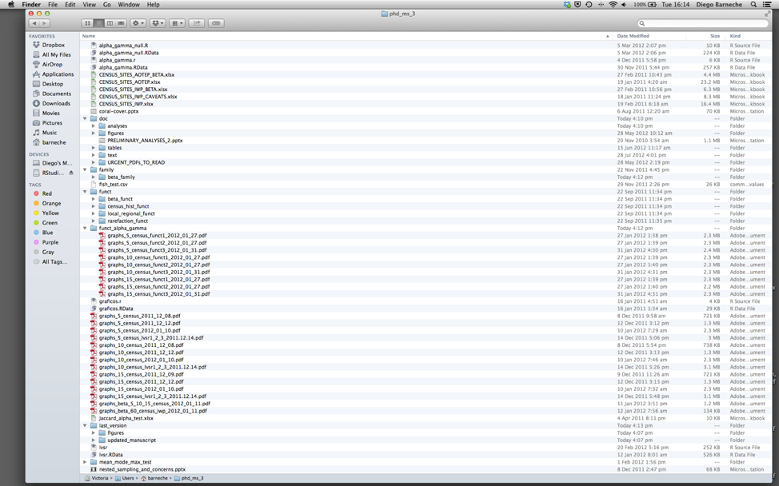

```{r setup, include=FALSE}
knitr::opts_chunk$set(echo = TRUE)
```

### Project Management with RStudio
#### Questions
*	How can I manage my projects, files, code in R?  

#### Objectives
*	Create self-contained projects in RStudio  
*	Use git client in RStudio  

### Introduction
The scientific process is naturally incremental, and many projects start life as random notes, some code, then a manuscript, and eventually everything is a bit mixed together. Managing your projects in a reproducible fashion doesn't just make your science reproducible, it makes your life easier.

Most people tend to organize their projects like this:

 
There are many reasons why we should ALWAYS avoid this:  
1. It is really hard to tell which version of your data is the original and which is the modified.  
2.	It gets really messy because it mixes files with various extensions together.  
3.	It probably takes you a lot of time to actually find things, and relate the correct figures to the exact code that has been used to generate it.  

A good project layout will ultimately make your life easier:  

*	It will help ensure the integrity of your data.   
*	It makes it simpler to share your code with someone else (a lab-mate, collaborator, or supervisor).  
*	It allows you to easily upload your code with your manuscript submission.    
*	It makes it easier to pick the project back up after a break.  

### A Possible Solution
Fortunately, there are tools and packages which can help you manage your work effectively. One of the most powerful and useful aspects of RStudio is its project management functionality. We’ll be using this today to create a self-contained, reproducible project.

### Creating a New Self-Contained Project
When we start R in a project directory, or open a project with RStudio, all of our work on this project will be entirely self-contained in this directory.

We’re going to create a new project in RStudio:     
1.	Click the “File” menu button, then “New Project”.  
2.	Click “New Directory”.  
3.	Click “New Project”. 
4.	Type in the name of the directory to store your project, e.g. “myproject”.  
5.	Make sure that the checkbox for “Create a git repository” is selected.  
6.	Click the “Create Project” button.  

#### Best Practices for Project Organization
Although there is no “best” way to lay out a project, there are some general principles to adhere to that will make project management easier:  
__1.	Treat data as read only__  
This is probably the most important goal of setting up a project. Data is typically time consuming and/or expensive to collect. Working with them interactively (e.g., in Excel) where they can be modified means you are never sure of where the data came from, or how it has been modified since collection. It is therefore a good idea to treat your data as “read-only”.  
__2.	Data Cleaning__  
In many cases your data will be “dirty”: it will need significant preprocessing to get into a format R (or any other programming language) will find useful. This task is sometimes called “data munging”. I find it useful to store these scripts in a separate folder and create a second “read-only” data folder to hold the “cleaned” data sets.  
__3.	Treat generated output as disposable__  
Anything generated by your scripts should be treated as disposable: it should all be able to be regenerated from your scripts. There are lots of different ways to manage this output. You might find it useful to have an output folder with different sub-directories for each separate analysis. This makes it easier later, as many of analyses are exploratory and don’t end up being used in the final project, and some of the analyses get shared between projects.  

#### Good _Enough_ Practices for Scientific Computing
[Good Enough Practices for Scientific Computing](https://github.com/swcarpentry/good-enough-practices-in-scientific-computing/blob/gh-pages/good-enough-practices-for-scientific-computing.pdf) gives the following recommendations for project organization:  
1.	Put each project in its own directory, which is named after the project.  
2.	Put text documents associated with the project in the doc directory.  
3.	Put raw data and metadata in the data directory, and files generated during cleanup and analysis in a results directory.  
4.	Put source for the project’s scripts and programs in the src directory, and programs brought in from elsewhere or compiled locally in the bin (binary executables) directory.  
5.	Name all files to reflect their content or function.  

***  

#### Even Better: ProjectTemplate 
One way to automate the management of projects is to install the third-party package, [ProjectTemplate](http://projecttemplate.net/index.html). This package will set up an ideal directory structure for project management. This is clean and efficient as it enables you to have your analysis pipeline/workflow organised and structured. Together with the default RStudio project functionality and Git you will be able to keep track of your work as well as be able to share your work with collaborators.  
1.	Set your working directory.    
2.	Install ProjectTemplate.  
3.	Load the library.  
4.	Initialise the project:  

At the R Console Prompt:
```
install.packages("ProjectTemplate")
library(ProjectTemplate)
create.project("../GEOG_Proj", merge.strategy = "allow.non.conflict")
```

Check out your new set of directories in the lower right (Files tab). For more information on ProjectTemplate and its functionality visit the home page ProjectTemplate

#### DIY Project Management
Or you can create your own template simply by creating the same sets of folders for a project each time - you could even save this as a Shell script.  For example, I create _data/_, _scripts/functions/_, _products/_, _README/_ to get started.

### Separate Function Definition and Application
The most effective way I find to work in R, is to play around in the interactive session, then copy commands across to a script file when I’m sure they work and do what I want. You can also save all the commands you’ve entered using the history command, but I don’t find it useful because when I’m typing its 90% trial and error (10% success).
When your project is new and shiny, the script file usually contains many lines of directly executed code. As it matures, reusable chunks get pulled into their own functions (more on that later). It’s a good idea to separate these into separate folders; one to store useful functions that you’ll reuse across analyses and projects, and one to store the analysis scripts.  

#### Keep It Clean
Since we won't actually be using _myproject_, be sure to delete the project from your directories.

***  

### Side Note: Avoiding Duplication
You may find yourself using data or analysis scripts across several projects. Typically, you want to avoid duplication to save space and avoid having to make updates to code in multiple places. In this case I find it useful to make “symbolic links”, which are essentially shortcuts to files somewhere else on a filesystem. On Linux and OS X you can use the `ln -s` command, and on windows you can either create a shortcut or use the `mklink` command from the windows terminal.

For example, say I wanted to make a symbolic link available everywhere on my machine to a text file like _MorgPre.csv_:


```{bash, engine='sh'}
ln -s ../data/MorgPre.csv MorgPre.csv
head -n 10 MorgPre.csv

``` 

One could make a symbolic link to any script or function used frequently as well.

#### Command line in R Studio
You can quickly open up a shell in RStudio using the `Tools -> Shell` menu item or click on the terminal tab. 


#### Versioning disposable output
Generally you do not want to version disposable output (or read-only data). You should modify the _.gitignore_ file to tell git to ignore these files and directories.

```{bash}
mkdir ../data/gapminder && cd ../data/gapminder
touch stuff.txt morestuff.html readonly.txt
git init
touch .gitignore
echo "*.html 
readonly*" > .gitignore
```

```{bash, echo=-1}
cd ../data/gapminder
git add .gitignore
git commit .gitignore -m "ignore html and readonly files"
git status
```


```{bash, echo=F}
cd ../data
rm -r gapminder
```

> __Challenge:__  

1.	Make a new project in RStudio.
2.  Either use ProjectTemplate or make your own set of folders for storing your work. 
3.  Make a folder called _/graphs_ where you will store all your figures.
4.	Modify the .gitignore file to contain all of the data in your _/graphs_ folder so that this disposable output isn’t versioned.  
5. Add the newly created folders to version control using the git interface.  


#### Key Points
*	Use RStudio to create and manage projects with consistent layout.  
*	Treat raw data as read-only.  
*	Treat generated output as disposable.  
*	Separate function definition and application.  
*	Use version control to track your own changes
* Avoid tracking files using .gitignore  
 


